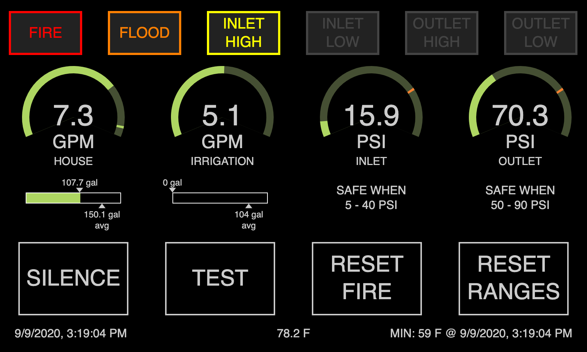
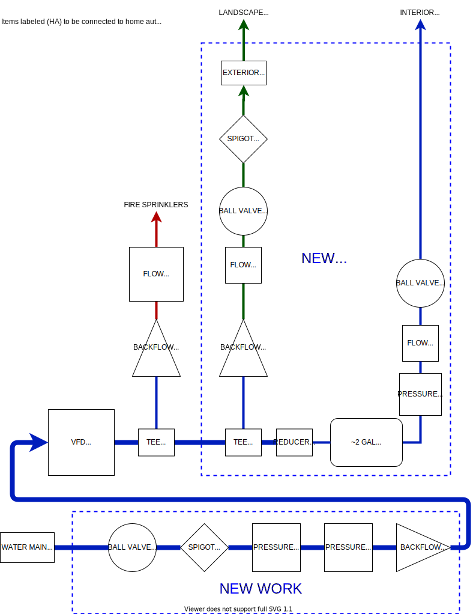

# Custom Plumbing / Water System Dashboard

## Background
My family and I live on a large hillside, with our house nearly 90 feet above the street level.  Since the water main is at the street, this leads to quite a bit of pressure loss by the time the water makes it up the hill. (There is typically only around 15PSI where it enters the house).  As a result, a water pump is required to boost the pressure back up to usable levels.  Additionally, the steep hill means that fire trucks cannot safely make it up the driveway, and therefore we are required to have fire sprinklers in the house (also plumbed through the same system). Lastly, the recent addition of an irrigation system for landscaping has introduced additional requirements on our plumbing.

Due to the geography in the area, the water company maintains a series of pressure reducing valves (PRVs) in the water system, to ensure delivery of safe pressures into the various homes connected to the system. Unfortunately, those PRVs tend to fail from time to time, and surprisingly do not do so in a safe manner. On multiple occasions, I have measured upwards of 135 PSI entering our house (even taking into acccount the 90 foot rise above the street!) This is a highly dangerous condition that has now occurred multiple times without warning.

Given all of these challenges, I wanted an automated system which could monitor the incoming water pressure, the pressure of the system inside our house, warn us if and when the fire sprinkler system is triggered, as well as monitor and display other basic stats such as water usage and system temperature (it freezes here in the winter). As I already use Home Assistant for other home automation tasks, it would also be nice if those statistics and conditions could be shared with it via MQTT.

Welcome to the plumbing-dashboard project!

## Components

### Water System
Since I had to hire a plumber to install the additional line and backflow preventer for our irrigation system, I decided to add all the required metering and sensors at the same time to minimize the labor costs. Here is a diagram of the work required:

### Sensor Hardware
The sensor hardware required for all the functionality is as follows:
* Potter Fire Flow Switch
* 2x DAE 1.0" Flow Meter with Pulse Output (0.1 gal per pulse)
* 2x Dwyer Instruments 628 S45617001 Pressure Gauge
* Raspberry Pi 3B+
* NCD.io 2-Channel 4-20 mA Current Loop Receiver

The Potter Fire Flow switch was already installed when our house was built, although the sprinkler contractor who put it in never hooked it up to anything. I imagine this is likely some kind of code violation, but honestly I'd rather utilize it for my own purposes (which will likely turn out way better than whatever 1950s technology they would have installed).

For the flow meters, I like DAE because they offer a version that gives one pulse per 0.1 gallon.  It seems that most pulse-based meters are a full gallon per pulse, which doesn't give me the resolution I want. With a goal of being able to detect smaller leaks in the house, I'd prefer not to need up to one gallon of water to go by before the flow is detectable.

Of all the components in the system, the pressure gauges probably took the most time to research.  For whatever reason, potable water pressure gauges which are digitally readable are hard to come by, especially reasonably priced ones. These from Dwyer are NSF rated for potable water, and give output via a 4-20ma loop, which is easily readable by a Raspberry Pi with the NCD.io current loop receiver (which connects to the Pi via i2c). The ones I bought are good from 0-200 PSI.

### Sensor Software
Since my goal is to make the sensor data available to whatever other devices and systems in my home which may require it, I chose to publish the data to MQTT. I already have an MQTT broker (Mosquitto) running as part of my Home Assistant installation, so I chose to publish sensor data there. This simplifies the sensor software such that it only needs to convert the incoming signals to usable values, and then publish those values to MQTT.

#### Fire Flow
The Fire Flow sensor is the simplest of all the sensors to sample.  It's just a switch, so GPIO on the Pi coupled with a resistor works perfectly.

#### Pressure Sensors
#### Flow Meters

### Dashboard

